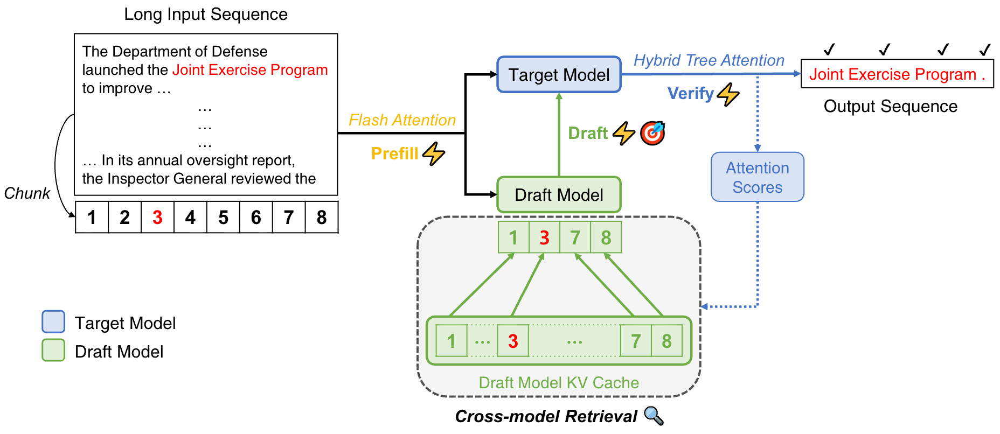

<h1 align="center">
  
  SpecExtend: A Drop-in Enhancement for Speculative Decoding of Long Sequences
</h1>

<p align="center">
  
</p>


## Introduction

While speculative decoding has emerged as an effective, lossless solution to accelerating LLM inference, its performance degrades significantly for even moderately long inputs. This is due to:

1. **Increased latency** in both drafting and verification steps due to the quadratic complexity of standard attention.
2. **Reduced draft accuracy**, as the draft model is typically smaller and trained only on short sequences.

**SpecExtend** addresses this by:

* **Accelerating forward passes** of both the draft and target models, integrating efficient attention mechanisms across all stages (FlashAttention & Hybrid Tree Attention).
* **Introducing Cross-model Retrieval**, a novel cache update strategy that uses the target model's attention scores to dynamically update the draft model’s KV cache with globally relevant context. This allows fine-grained alignment between the target and draft model, boosting both draft speed and accuracy on long inputs without retraining.

SpecExtend achieves up to:

* **2.84×** speedup on the long document summarization task with Vicuna 7B and 68M on inputs up to 16K tokens of GovReport.

SpecExtend also preserves performance on short sequences, is training-free and compatible with SOTA speculative decoding frameworks.

<div align="center">
  <!-- First GIF + italic caption -->
  <figure style="display: inline-block; margin: 0;">
    
    <figcaption><em>Input length: 2K</em></figcaption>
  </figure>
  <br/><br/>

  <!-- Second GIF + italic caption -->
  <figure style="display: inline-block; margin: 0;">
    
    <figcaption><em>Input length: 16K</em></figcaption>
  </figure>
  <br/>
</div>

<p align="center">
  Inference is conducted using Vicuna 7B and 68M as target and draft models, on a single A100 80GB GPU at fp16 precision.
</p>


## Installation

### 1. Clone & Setup Virtual Environment

```bash
git clone https://github.com/jycha98/SpecExtend.git
cd SpecExtend/specextend
python3 -m venv .venv
source .venv/bin/activate
```

### 2. Install PyTorch (CUDA 12.1)

```bash
pip install --upgrade pip
pip install torch==2.4.0 --extra-index-url https://download.pytorch.org/whl/cu121
```

### 3. Install flash-attn (Pre-built Wheel, No Compilation)

Instead of building from source, use the pre-built wheel for faster installation:

```bash
# Download pre-built wheel (flash-attn 2.6.3 + CUDA 12.1 + torch 2.4 + Python 3.12)
wget https://github.com/mjun0812/flash-attention-prebuild-wheels/releases/download/v0.0.2/flash_attn-2.6.3%2Bcu121torch2.4-cp312-cp312-linux_x86_64.whl
pip install flash_attn-2.6.3+cu121torch2.4-cp312-cp312-linux_x86_64.whl
```

### 4. Install Remaining Dependencies

```bash
pip install transformers==4.41.0 accelerate==0.21.0 sentencepiece==0.1.99 \
    termcolor==3.1.0 tqdm==4.67.1 gradio==5.32.1 ninja==1.11.1.4 \
    protobuf==3.19.0 tokenizers==0.19.1
```

### 5. Download Models

Models are cached under a **data disk** (e.g. `/root/autodl-tmp/huggingface`) to avoid filling up system storage.

```bash
# Option A: Use HuggingFace mirror (no proxy needed)
export HF_HOME=/root/autodl-tmp/huggingface
export HF_ENDPOINT=https://hf-mirror.com
huggingface-cli download lmsys/vicuna-7b-v1.5-16k
huggingface-cli download double7/vicuna-68m

# Option B: Use proxy acceleration
source /etc/network_turbo
huggingface-cli download lmsys/vicuna-7b-v1.5-16k
huggingface-cli download double7/vicuna-68m
```

**Required models:**
- **Target**: `lmsys/vicuna-7b-v1.5-16k` (~13.5 GB)
- **Draft**: `double7/vicuna-68m` (~260 MB)

### 6. Offline Inference

Before running, set `HF_HOME` so the script loads models from the local cache (no internet required):

```bash
source .venv/bin/activate
export HF_HOME=/root/autodl-tmp/huggingface
```

#### Baseline (without SpecExtend)

```bash
python run_classic.py \
  --input_file data/govreport/govreport_2K.jsonl \
  --model_name vicuna_7b \
  --max_gen_len 256 \
  --max_samples 1
```

#### With SpecExtend

```bash
python run_classic.py \
  --input_file data/govreport/govreport_2K.jsonl \
  --model_name vicuna_7b \
  --use_specextend \
  --verbose \
  --output_result_line \
  --max_gen_len 256 \
  --max_samples 1
```

#### Edge-Cloud Collaborative SpecExtend

Use this mode when the draft model runs on an edge GPU and the target model runs on a cloud GPU. The runner places the draft and target models on separate devices, simulates network transfer latency/bandwidth, overlaps cloud verification with conservative edge-side async draft probes, and writes detailed timing metrics.

Edit `configs/edge_cloud.json` to change:

- `edge_device`: GPU for the draft model, for example `cuda:0`
- `cloud_device`: GPU for the target model, for example `cuda:1`
- `network.rtt_ms`: simulated round-trip time
- `network.uplink_mbps`: edge-to-cloud bandwidth
- `network.downlink_mbps`: cloud-to-edge bandwidth
- `async_pipeline.enabled`: whether the edge continues drafting while cloud verification is pending
- `async_pipeline.draft_probe_tokens`: how many speculative probe tokens the edge attempts per async polling cycle
- `metrics_output`: JSON metrics output path

```bash
python run_classic.py \
  --input_file data/govreport/govreport_2K.jsonl \
  --model_name vicuna_7b \
  --use_specextend \
  --edge_cloud_config configs/edge_cloud.json \
  --metrics_output edge_cloud_metrics.json \
  --max_gen_len 256 \
  --max_samples 1
```

The metrics JSON includes generated-token throughput, acceptance lengths, simulated uplink/downlink bytes and seconds, target/cloud forward time, target tree verification time, edge draft time, and async draft probe work.

### 7. Performance Comparison (Example)

On a single RTX 3090 with Vicuna 7B + Vicuna 68M, `govreport_2K` sample, generating 256 tokens:

| Method | Wall-clock Time |
|--------|-----------------|
| Baseline (no SpecExtend) | ~15.7 s |
| SpecExtend | ~16.3 s |

> **Note:** Speculative decoding overhead can exceed gains on very short inputs. Significant speedups (up to **2.84x**) are observed on longer sequences (e.g. 16K tokens) where draft model acceptance rates are higher.

## Evaluation

We also provide scripts to evaluate SpecExtend's performance on GovReport and PG-19.

```bash
python eval_classic.py \
  --data_dir data/govreport \
  --samples_per_length 20 \
  --runs_per_sample 2 \
  --model_name vicuna_7b \
  --use_specextend \
  --max_gen_len 256 \
  --output_file eval_results_classic.json
```

## Project Files

| File | Description |
|------|-------------|
| `download_models_mirror.sh` | Download models via HF mirror |
| `monitor_download.py` | Monitor download progress & detect stuck transfers |
| `run_classic.py` | Inference script (modified for local cache paths) |
| `classic/model_classic.py` | Model wrapper (with `local_files_only=True` for offline loading) |
